# Diagrama de Funções - Sistema Matriz (ASBUILT)

Fluxo de chamadas quando o usuário executa o comando **MATRIZ** no AutoCAD.

---

## Visão Geral do Fluxo Principal

```
C:MATRIZ                                                    [ENEL-MATRIZ-01.lsp]
    │
    ├── ESHOP-CSV-FECHADO-ABERTO                             [FUNC-CSV_TXT-REV00.lsp]
    │
    └── ENEL_ASBUILT                                         [ENEL-ASBUILT-01.lsp]
            │
            ├── [1] ENEL_INICIO                              [ENEL-MATRIZ-01.lsp]
            │
            ├── [2] ENEL_CONVERTE_MATRIZ_NOVA                [ENEL-ASBUILT-01.lsp]
            │       ├── load modulos.lsp                     [modulos.lsp]
            │       └── ENEL_LISTA_PADRAO                    [ENEL-SISTEMA-01.lsp]
            │
            ├── [2b] GLB_FAIXA, GLB_ARVORE                  [ENEL-ASBUILT-01.lsp]
            │
            ├── [4] GERAR_DADOS_PROJ+                        [ENEL-DADOS PROJ-11.lsp]
            │       └── ENEL_IMPRIMIR                        [ENEL-SISTEMA-01.lsp]
            │
            ├── [5] CRIA_PROJETO_CAD                         [ENEL-CRIAR CAD-13.lsp]
            │       ├── MODULAR_EQT                          [ENEL-MODULARES-01.lsp]
            │       ├── CRIARCAD_INSERIR_BLOCOS_REDE          [ENEL-CRIAR CAD-13.lsp]
            │       ├── INSERIR_ESTAIS                       [ENEL-CRIAR CAD-13.lsp]
            │       └── ENEL_SALVA_ARQUIVOS                  [ENEL-SISTEMA-01.lsp]
            │
            └── [6] ENEL_FIM                                 [ENEL-MATRIZ-01.lsp]
```

---

## Etapa 1: ENEL_INICIO
**Arquivo:** ENEL-MATRIZ-01.lsp  
**Função:** Configuração inicial do ambiente (variáveis, UNDO, pasta de blocos)

```
ENEL_INICIO
    └── (sem chamadas a outras funções do sistema)
```

---

## Etapa 2: ENEL_CONVERTE_MATRIZ_NOVA
**Arquivo:** ENEL-ASBUILT-01.lsp  
**Função:** Lê MATRIZ_NOVA.csv e converte para formato interno (lst2, lst4)

**Implementado:**
- Agrupa 4 linhas por sequência (implantar, existente, retirar, deslocar = 1 poste)
- Coordenadas sempre da primeira linha com utm_x/utm_y (mesmo que poste esteja em outra linha)
- Colunas adicionais: STATUS, AZIMUTE, DERIVA, LST_CABOS

```
ENEL_CONVERTE_MATRIZ_NOVA
    ├── ENEL_LISTA_PADRAO          [ENEL-SISTEMA-01]
    ├── load modulos.lsp           [modulos.lsp]
    ├── ESHOP-CNV-STR-LST          [FUNC-CSV_TXT-REV00] (parse linha CSV)
    ├── ENEL_TENSAO_FROM_CB        [modulos.lsp]
    │       └── ENEL_MODULO_TENSAO → ENEL_MODULO_BY_CODIGO
    ├── ENEL_MODULO_CABO           [modulos.lsp] (descrição do cabo por código)
    └── ENEL_STATUS_SUFIXO         [modulos.lsp] (_IMPL, _EXIST, _RET, _DESLOC)
```

**Estrutura lst4 por linha:** ... status, azimute, deriva, lst_cabos  
**lst_cabos:** lista de strings "cabo_SUFIXO" (ex: "1#1/0CAA_IMPL", "1#1/0CAA_DESLOC")

---

## Etapa 3: VALIDA_MATRIZ (REMOVIDA)
**Status:** Chamada removida - CSV considerado correto. GLB_FAIXA e GLB_ARVORE somados em ENEL_ASBUILT.

---

## Etapa 4: GERAR_DADOS_PROJ+
**Arquivo:** ENEL-DADOS PROJ-11.lsp  
**Função:** Monta lista para DADOS_PROJ (baremos/orçamento)

```
GERAR_DADOS_PROJ+
    └── [repeat para cada poste]
            ├── ESHOP-TRS_LST_TXT_VAR
            ├── ESHOP-CRR_LST_CRT_IGU
            ├── ENEL_DIST_DADOS_PROJ
            ├── ENEL_MONTAR_ESTRUTURAS
            │       └── ESHOP-SBT_ELM_LST_SEQ (múltiplas vezes)
            └── (append lista_matriz)
    └── ENEL_IMPRIMIR
            └── ESHOP-IMP_TAB_CVS, ESHOP-CNV_LST_STR_CSV
```

---

## Etapa 5: CRIA_PROJETO_CAD
**Arquivo:** ENEL-CRIAR CAD-13.lsp  
**Função:** Desenha a rede no CAD

**Implementado:**

### 5.1 Desenho de linhas conforme DERIVA
- **lst_pto:** mapeia (seq . ponto) para cada poste
- **lst_segments:** lista (pto_orig pto_dest) para cada segmento
- **Regra:** DERIVA vazia → linha do poste anterior ao atual; DERIVA = N → linha do poste N ao atual
- Cada segmento desenhado com `command ".line"`; fallback polilinha sequencial se lst_segments vazio

### 5.2 Bloco do poste conforme STATUS
- PT_IMPL (implantar), PT_EXIST (existente), PT_RET (retirar), PT_DESLOC (deslocar), PT_RET_IMPL (retirar+implantar)
- Posição: utm_x, utm_y da 1ª linha
- Rotação: coluna azimute

### 5.3 Cabos (LST_CABOS)
- Exibe todos os cabos do poste como texto
- Formato: descrição da tabela módulos + sufixo (ex: 1#1/0CAA_IMPL, 1#1/0CAA_DESLOC)
- Posição: perpendicular ao azimute, empilhados

```
CRIA_PROJETO_CAD (loop para cada poste)
    │
    ├── ESHOP-ZOM_RAI
    ├── ESHOP-TRS_LST_TXT_VAR
    ├── [poste inicial] MODULAR_EQT
    ├── ENEL_DEFLEX (ângulo deflexão)
    │
    ├── Acumula lst_pto, lst_segments (DERIVA: vazio=pto1, valor=assoc em lst_pto)
    │
    ├── [poste final] Desenho de segmentos
    │       ├── lst_segments: command ".line" para cada (pto_orig pto_dest)
    │       ├── gbl_compr = soma distâncias
    │       └── Fallback: polilinha sequencial se lst_segments nil
    │
    ├── CRIARCAD_INSERIR_BLOCOS_REDE
    │       ├── ESHOP-ZOM_RAI
    │       ├── command "-INSERT" BLOCO_PONTO_TEXTO2
    │       ├── GERAR_LISTA_TXT
    │       ├── command "-INSERT" MTZ_ANG_DEFLEX2
    │       ├── command "-INSERT" MTZ_TXT_VAO_FROUXO
    │       ├── command "-INSERT" BLOCO_POSTE (PT_IMPL, PT_EXIST, PT_RET, PT_DESLOC)
    │       ├── GERAR_LISTA_ELM
    │       ├── Texto cabos LST_CABOS (foreach cabo: command "_.text" cabo_SUFIXO)
    │       ├── command "-INSERT" MTZ_TXT_DISTANCIA2
    │       ├── command "-INSERT" MTZ_CORTE_ARVORE2 / MTZ_ABERTURA_FAIXA2
    │       ├── INSERIR_ESTAIS
    │       ├── BASE_REFORCADA, BASE_CONCRETO
    │       └── MTZ_INSERE_CARIMBO (se var1="fim")
    │
    └── ENEL_SALVA_ARQUIVOS
            └── ENEL_IMPRIMIR, command "_.qsave"
```

---

## Módulos (modulos.lsp)

```
modulos.lsp
    ├── ENEL_MODULOS_INIT          (tabela GLB_LST_MODULOS)
    ├── ENEL_MODULO_BY_CODIGO      (busca por código)
    ├── ENEL_MODULO_TENSAO         (código 15/36)
    ├── ENEL_MODULO_CABO           (descrição ex: "1#1/0CAA")
    ├── ENEL_TENSAO_FROM_CB        (tensão das colunas CB_1A...CB_BT3)
    └── ENEL_STATUS_SUFIXO         (_IMPL, _EXIST, _RET, _DESLOC)
```

---

## Etapa 6: ENEL_FIM
**Arquivo:** ENEL-MATRIZ-01.lsp  
**Função:** Restaura variáveis e encerra UNDO

---

## Diagrama por Arquivo .lsp

```
┌──────────────────────────────────────────────────────────────────────────────────┐
│                           ARQUIVOS .LSP DO SISTEMA MATRIZ                          │
└──────────────────────────────────────────────────────────────────────────────────┘

  ENEL-MATRIZ-01.lsp ◄──── ponto de entrada (C:MATRIZ)
       │
       ├──► ENEL-ASBUILT-01.lsp ◄──── fluxo principal (ENEL_ASBUILT)
       │         │
       │         ├──► modulos.lsp (ENEL_MODULO_CABO, ENEL_STATUS_SUFIXO, ENEL_TENSAO_FROM_CB)
       │         ├──► ENEL-SISTEMA-01.lsp (ENEL_LISTA_PADRAO)
       │         └──► FUNC-CSV_TXT-REV00.lsp (ESHOP-CNV-STR-LST)
       │
       ├──► ENEL-DADOS PROJ-11.lsp (GERAR_DADOS_PROJ+)
       │         └──► ENEL-SISTEMA-01.lsp (ENEL_IMPRIMIR)
       │
       └──► ENEL-CRIAR CAD-13.lsp (CRIA_PROJETO_CAD, CRIARCAD_INSERIR_BLOCOS_REDE)
                 ├──► ENEL-MODULARES-01.lsp (MODULAR_EQT)
                 ├──► ENEL-SISTEMA-01.lsp (ENEL_SALVA_ARQUIVOS)
                 └──► FUNC-PLINE_LINE-00.lsp (ESHOP-PTOS_PLINE_REP)

  Arquivos utilitários:
  ├── FUNC-CSV_TXT-REV00.lsp  (parse CSV, tabelas, variáveis)
  ├── ENEL-SISTEMA-01.lsp     (listas, salvar, imprimir)
  ├── modulos.lsp             (tabela cabos/tensão, sufixos status)
  ├── ENEL-MODULARES-01.lsp   (equipamentos modulares)
  └── LOAD_TODOS.lsp          (diagnóstico: carrega .lsp um a um)
```

---

## Mapa de Arquivos por Função

| Arquivo | Funções Principais |
|---------|---------------------|
| **ENEL-MATRIZ-01.lsp** | C:MATRIZ, ENEL_INICIO, ENEL_FIM, erro |
| **ENEL-ASBUILT-01.lsp** | ENEL_ASBUILT, ENEL_CONVERTE_MATRIZ_NOVA |
| **ENEL-DADOS PROJ-11.lsp** | GERAR_DADOS_PROJ+, ENEL_DIST_DADOS_PROJ, ENEL_MONTAR_ESTRUTURAS |
| **ENEL-CRIAR CAD-13.lsp** | CRIA_PROJETO_CAD, CRIARCAD_INSERIR_BLOCOS_REDE, CRIARCAD_INSERIR_BLOCOS_PLANTA_BAIXA, INSERIR_ESTAIS, ENEL_DEFLEX, MTZ_INSERE_CARIMBO, ORGANIZA_CAD_TEMP |
| **ENEL-SISTEMA-01.lsp** | ENEL_LISTA_PADRAO, ENEL_SALVA_ARQUIVOS, ENEL_IMPRIMIR |
| **ENEL-MODULARES-01.lsp** | MODULAR_EQT, TRANSF_LST_VARIAVEL |
| **modulos.lsp** | ENEL_MODULOS_INIT, ENEL_MODULO_BY_CODIGO, ENEL_MODULO_TENSAO, ENEL_MODULO_CABO, ENEL_TENSAO_FROM_CB, ENEL_STATUS_SUFIXO |
| **FUNC-CSV_TXT-REV00.lsp** | ESHOP-CNV-STR-LST, ESHOP-CNV-CSV-LST, ESHOP-TRS_LST_TXT_VAR, ESHOP-IMP_TAB_CVS |
| **FUNC-PLINE_LINE-00.lsp** | ESHOP-PTOS_PLINE_REP |
| **LOAD_TODOS.lsp** | C:LOAD_TODOS (diagnóstico: carrega arquivos um a um) |

---

## Diagrama Mermaid (por arquivo .lsp)

```mermaid
flowchart TB
    subgraph ENEL_MATRIZ["ENEL-MATRIZ-01.lsp"]
        C_MATRIZ["C:MATRIZ"]
        ENEL_INICIO["ENEL_INICIO"]
        ENEL_FIM["ENEL_FIM"]
    end

    subgraph ENEL_ASBUILT["ENEL-ASBUILT-01.lsp"]
        ENEL_ASBUILT_FN["ENEL_ASBUILT"]
        ENEL_CONVERTE["ENEL_CONVERTE_MATRIZ_NOVA"]
    end

    subgraph FUNC_CSV["FUNC-CSV_TXT-REV00.lsp"]
        ESHOP_CSV["ESHOP-CSV-FECHADO-ABERTO"]
        ESHOP_CNV["ESHOP-CNV-STR-LST"]
        ESHOP_TRS["ESHOP-TRS_LST_TXT_VAR"]
    end

    subgraph MODULOS["modulos.lsp"]
        ENEL_TENSAO["ENEL_TENSAO_FROM_CB"]
        ENEL_CABO["ENEL_MODULO_CABO"]
        ENEL_SUFIXO["ENEL_STATUS_SUFIXO"]
    end

    subgraph ENEL_SISTEMA["ENEL-SISTEMA-01.lsp"]
        ENEL_LISTA["ENEL_LISTA_PADRAO"]
        ENEL_SALVA["ENEL_SALVA_ARQUIVOS"]
        ENEL_IMPRIMIR["ENEL_IMPRIMIR"]
    end

    subgraph ENEL_DADOS["ENEL-DADOS PROJ-11.lsp"]
        GERAR_DADOS["GERAR_DADOS_PROJ+"]
        ENEL_DIST["ENEL_DIST_DADOS_PROJ"]
        ENEL_MONTAR["ENEL_MONTAR_ESTRUTURAS"]
    end

    subgraph ENEL_CRIAR["ENEL-CRIAR CAD-13.lsp"]
        CRIA_CAD["CRIA_PROJETO_CAD"]
        INSERIR_BLOCOS["CRIARCAD_INSERIR_BLOCOS_REDE"]
        INSERIR_ESTAIS["INSERIR_ESTAIS"]
        ENEL_DEFLEX["ENEL_DEFLEX"]
    end

    subgraph ENEL_MODULARES["ENEL-MODULARES-01.lsp"]
        MODULAR_EQT["MODULAR_EQT"]
    end

    subgraph FUNC_PLINE["FUNC-PLINE_LINE-00.lsp"]
        ESHOP_PTOS["ESHOP-PTOS_PLINE_REP"]
    end

    C_MATRIZ --> ESHOP_CSV
    ESHOP_CSV --> ENEL_ASBUILT_FN
    ENEL_ASBUILT_FN --> ENEL_INICIO
    ENEL_ASBUILT_FN --> ENEL_CONVERTE
    ENEL_ASBUILT_FN --> GERAR_DADOS
    ENEL_ASBUILT_FN --> CRIA_CAD
    ENEL_ASBUILT_FN --> ENEL_FIM

    ENEL_CONVERTE --> ENEL_LISTA
    ENEL_CONVERTE --> ENEL_TENSAO
    ENEL_CONVERTE --> ENEL_CABO
    ENEL_CONVERTE --> ENEL_SUFIXO
    ENEL_CONVERTE --> ESHOP_CNV

    GERAR_DADOS --> ENEL_DIST
    GERAR_DADOS --> ENEL_MONTAR
    GERAR_DADOS --> ENEL_IMPRIMIR

    CRIA_CAD --> MODULAR_EQT
    CRIA_CAD --> INSERIR_BLOCOS
    CRIA_CAD --> ENEL_SALVA
    CRIA_CAD --> ENEL_DEFLEX
    CRIA_CAD --> ESHOP_PTOS
    INSERIR_BLOCOS --> INSERIR_ESTAIS
```



---

## Resumo das Implementações

| Item | Descrição |
|------|-----------|
| **Coordenadas** | Sempre da 1ª linha (implantar), aplicáveis ao ponto inteiro |
| **DERIVA** | Vazia → linha do anterior ao atual; valor N → linha do poste N ao atual |
| **Segmentos** | `command ".line"` para cada par (pto_orig pto_dest) em lst_segments |
| **Bloco** | PT_IMPL, PT_EXIST, PT_RET, PT_DESLOC conforme STATUS |
| **Cabos** | LST_CABOS exibida como texto: cabo + sufixo (_IMPL, _EXIST, _RET, _DESLOC) |
| **modulos.lsp** | ENEL_MODULO_CABO, ENEL_STATUS_SUFIXO, ENEL_TENSAO_FROM_CB |
| **Validação** | Removida; totais GLB_FAIXA/GLB_ARVORE somados em ENEL_ASBUILT |

---

## Resumo por Etapa

| # | Etapa | Objetivo | Arquivo principal |
|---|-------|----------|-------------------|
| 1 | **ENEL_INICIO** | Configurar ambiente, paths, UNDO | ENEL-MATRIZ-01 |
| 2 | **ENEL_CONVERTE_MATRIZ_NOVA** | CSV→lst2/lst4, agrupar 4 linhas/poste, DERIVA, LST_CABOS | ENEL-ASBUILT-01, modulos.lsp |
| 2b | **GLB_FAIXA/GLB_ARVORE** | Acumula totais para carimbo ambiental | ENEL-ASBUILT-01 |
| 4 | **GERAR_DADOS_PROJ+** | Montar baremos, imprimir CSV | ENEL-DADOS PROJ-11 |
| 5 | **CRIA_PROJETO_CAD** | Desenhar rede (DERIVA), blocos (STATUS), cabos (LST_CABOS) | ENEL-CRIAR CAD-13 |
| 6 | **ENEL_FIM** | Restaurar variáveis | ENEL-MATRIZ-01 |
